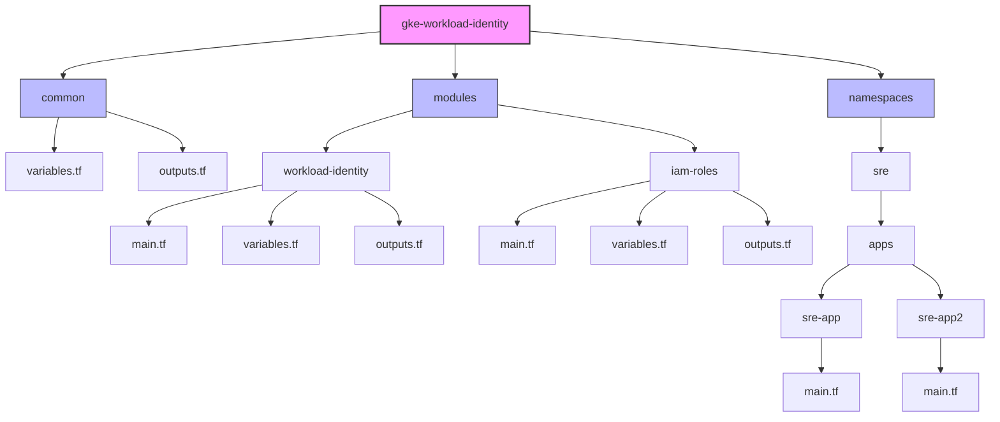

<div align="center">

# 🔐 Workload Identity Federation - GKE 🔐

[](https://www.terraform.io/)
[](https://cloud.google.com/)
[](https://kubernetes.io/)
[](https://opensource.org/licenses/MIT)

</div>

## 📋 Visão geral

Este módulo implementa a configuração de **Workload Identity Federation** para o Google Kubernetes Engine (GKE), permitindo que pods no Kubernetes acessem recursos do Google Cloud de forma segura sem necessidade de armazenar credenciais estáticas.

> 💡 O Workload Identity Federation é o método **recomendado pelo Google** para permitir que workloads em execução no GKE acessem serviços do Google Cloud de forma segura, substituindo o uso de chaves de conta de serviço estáticas por tokens temporários obtidos automaticamente.

## 🎁 Recursos provisionados

<table>
  <tr>
    <td>
      <ul>
        <li>🔑 Definições de roles IAM para PubSub e Storage</li>
        <li>🔗 Configurações e outputs para Workload Identity Federation</li>
        <li>📂 Estrutura de namespaces para organização de aplicações</li>
        <li>👤 Service Accounts do Google Cloud (GSAs) vinculadas às Service Accounts do Kubernetes (KSAs)</li>
      </ul>
    </td>
    <td>
      
    </td>
  </tr>
</table>

## 📂 Estrutura do Módulo

<div align="center">

### Arquitetura do Projeto

</div>

```
gke-workload-identity/
├─ outputs.tf             # Outputs para referência externa 💾
├─ provider.tf            # Configuração do provider 🔗
├─ ARCHITECTURE.md        # Documentação da arquitetura 📝
├─ common/                # Módulo de variáveis compartilhadas 🔐
│   ├─ variables.tf       # Variáveis centralizadas 📊
│   └─ outputs.tf         # Outputs individuais 💾
├─ modules/               # Módulos reutilizáveis 💻
│   ├─ workload-identity/ # Configuração de identidade 👤
│   │   ├─ main.tf       # Lógica principal ⚙️
│   │   ├─ variables.tf   # Variáveis específicas 📊
│   │   └─ outputs.tf     # Outputs relacionados 💾
│   └─ iam-roles/        # Gerenciamento de roles IAM 🔑
│       ├─ main.tf       # Lógica para roles ⚙️
│       ├─ variables.tf   # Variáveis específicas 📊
│       └─ outputs.tf     # Outputs relacionados 💾
└─ namespaces/            # Organização por namespaces 📂
    └─ sre/               # Namespace SRE 🛠️
        └─ apps/          # Aplicações 💻
            ├─ sre-app/    # Exemplo de aplicação 📦
            │   └─ main.tf  # Configuração ⚙️
            └─ sre-app2/   # Outro exemplo 📦
                └─ main.tf  # Configuração ⚙️
```

<div align="center">
<details>
<summary><b>📍 Clique para ver o diagrama de arquitetura</b></summary>
<br>



</details>
</div>

### 📍 Explicação da Estrutura

<table>
  <tr>
    <th align="center">💾 Componente</th>
    <th align="center">📃 Descrição</th>
  </tr>
  <tr>
    <td>
      <b>🌐 Raiz do Projeto</b>
    </td>
    <td>
      <ul>
        <li><code>outputs.tf</code>: Exporta informações importantes do projeto</li>
        <li><code>provider.tf</code>: Configura os providers Terraform</li>
        <li><code>ARCHITECTURE.md</code>: Documentação detalhada da arquitetura</li>
      </ul>
    </td>
  </tr>
  <tr>
    <td>
      <b>🔐 Módulo Common</b>
    </td>
    <td>
      <ul>
        <li>Centraliza todas as variáveis e configurações compartilhadas</li>
        <li><code>variables.tf</code>: Define variáveis e locals para todo o projeto</li>
        <li><code>outputs.tf</code>: Exporta cada variável local como um output individual</li>
      </ul>
    </td>
  </tr>
  <tr>
    <td>
      <b>💻 Módulos Reutilizáveis</b>
    </td>
    <td>
      <ul>
        <li><b>workload-identity</b>: Gerencia a configuração de identidade entre Kubernetes e Google Cloud</li>
        <li><b>iam-roles</b>: Gerencia permissões IAM de forma declarativa, com mecanismos para adicionar e remover roles</li>
      </ul>
    </td>
  </tr>
  <tr>
    <td>
      <b>📂 Namespaces e Aplicações</b>
    </td>
    <td>
      <ul>
        <li>Organização hierárquica por namespace e aplicação</li>
        <li>Cada aplicação importa o módulo common e usa seus outputs individuais</li>
        <li>Cada aplicação utiliza os módulos workload-identity e iam-roles para configurar suas permissões</li>
      </ul>
    </td>
  </tr>
</table>

## 🛠️ Abordagem Arquitetural e Refatoração

<div align="center">


</div>

Este projeto foi refatorado seguindo princípios de engenharia de software para melhorar a manutenção, reutilização e segurança. Abaixo estão as principais escolhas arquiteturais e suas justificativas:

### 1. 🔗 Separação de Responsabilidades

<div align="center">

</div>

Adotamos uma arquitetura modular com clara separação de responsabilidades:

<table>
  <tr>
    <th align="center">💾 Módulo</th>
    <th align="center">📃 Responsabilidade</th>
  </tr>
  <tr>
    <td align="center"><code>workload-identity</code></td>
    <td>Configuração da identidade (GSAs e KSAs)</td>
  </tr>
  <tr>
    <td align="center"><code>iam-roles</code></td>
    <td>Gerenciamento de permissões IAM</td>
  </tr>
  <tr>
    <td align="center"><code>common</code></td>
    <td>Centralização de variáveis e configurações</td>
  </tr>
</table>

Esta separação permite que cada componente seja desenvolvido, testado e mantido independentemente, facilitando a manutenção e reduzindo o risco de mudanças não intencionais.

### 2. 🔑 Gerenciamento Declarativo de Permissões

<div align="center">

</div>

O módulo `iam-roles` implementa uma abordagem declarativa para gerenciar permissões:

<table>
  <tr>
    <th align="center">🎁 Recurso</th>
    <th align="center">📃 Descrição</th>
  </tr>
  <tr>
    <td align="center"><code>roles_to_add</code></td>
    <td>Lista de roles IAM que devem ser concedidas à service account</td>
  </tr>
  <tr>
    <td align="center"><code>roles_to_remove</code></td>
    <td>Lista de roles IAM que devem ser explicitamente removidas</td>
  </tr>
  <tr>
    <td align="center"><code>google_project_iam_binding</code></td>
    <td>Garante que o Terraform gerencie completamente o ciclo de vida das permissões</td>
  </tr>
</table>

<div align="center">

#### ✨ Benefícios

</div>

- 🎟️ Controle granular sobre as permissões
- 🚫 Remoção explícita de roles não desejadas
- 🤖 Evitar permissões "zumbi" que persistem mesmo após serem removidas do código

### 3. 💾 Centralização de Variáveis e Configurações

<div align="center">

</div>

O módulo `common` centraliza todas as variáveis e configurações compartilhadas:

<table>
  <tr>
    <th align="center">📊 Categoria</th>
    <th align="center">📃 Variáveis</th>
  </tr>
  <tr>
    <td align="center">Projeto</td>
    <td><code>project_id</code>, <code>region</code>, <code>zone</code></td>
  </tr>
  <tr>
    <td align="center">Workload Identity</td>
    <td><code>workload_identity_pool</code></td>
  </tr>
  <tr>
    <td align="center">Kubernetes</td>
    <td>Dados de conexão com o cluster GKE (sensível)</td>
  </tr>
</table>

<div align="center">

#### ✨ Benefícios

</div>

- 📚 **DRY (Don't Repeat Yourself)**: Eliminação de duplicação de código
- 🔗 **Consistência**: Garantida entre todas as aplicações
- 👷 **Facilidade de manutenção**: Mudanças em um único lugar são refletidas em todo o projeto

### 4. Princípio do Privilégio Mínimo

Implementamos opções detalhadas de permissões para Storage e PubSub:

- **Storage**: Desde `roles/storage.objectViewer` (apenas leitura) até `roles/storage.admin` (controle total)
- **PubSub**: Desde `roles/pubsub.subscriber` (apenas consumir) até `roles/pubsub.admin` (controle total)

Esta granularidade permite que cada aplicação receba apenas as permissões mínimas necessárias para seu funcionamento, reduzindo a superfície de ataque e seguindo as melhores práticas de segurança.

### 5. Reutilização de Service Accounts

O projeto suporta a reutilização de GSAs e KSAs existentes:

- **`create_gsa = false`**: Usa uma GSA existente em vez de criar uma nova
- **`create_ksa = false`**: Usa uma KSA existente em vez de criar uma nova

Esta flexibilidade permite que o módulo seja usado em ambientes onde as service accounts já foram criadas por outros processos ou em migrações de infraestrutura existente.

### 6. Padronização entre Aplicações

Todas as aplicações (`sre-app`, `sre-app2`, etc.) seguem o mesmo padrão de configuração:

- Importam o módulo `common` para variáveis compartilhadas
- Usam o módulo `workload-identity` para configuração de identidade
- Usam o módulo `iam-roles` para gerenciamento de permissões

Esta padronização facilita o onboarding de novos desenvolvedores e a criação de novas aplicações, além de garantir consistência em todo o projeto.

## 📝 Pré-requisitos

<div align="center">

| 🔰 | Requisito |
|:---:|:---|
| 📡 | Cluster GKE com Workload Identity habilitado |
| 🔑 | Permissões para criar e gerenciar Service Accounts no Google Cloud |
| 🔐 | Permissões para conceder roles IAM às Service Accounts |
| ⚙️ | Kubernetes Provider configurado para acessar o cluster GKE |
| 💾 | Backend GCS configurado para armazenamento do estado do Terraform |

</div>

## 💬 Variáveis

<div align="center">

### ⚠️ Obrigatórias

| Nome | Descrição | Tipo |
|:------:|:-----------:|:----:|
| `project_id` | ID do projeto Google Cloud | string |
| `workload_identity_pool` | ID do pool de identidade do Workload Identity | string |

### ⚙️ Opcionais

| Nome | Descrição | Valor padrão | Tipo |
|:------:|:-----------:|:-------------:|:----:|
| `region` | Região do Google Cloud | `us-central1` | string |
| `zone` | Zona do Google Cloud | `us-central1-c` | string |

</div>

## 💻 Uso

<div align="center">

### 🔗 Configuração Básica

</div>

```hcl
module "workload_identity" {
  source = "./environments/shared/development/gke-workload-identity"
  
  project_id           = "seu-projeto-id"
  workload_identity_pool = "seu-projeto-id.svc.id.goog"
}
```

### Adicionando uma nova aplicação

1. Crie um novo diretório para a aplicação em `namespaces/NAMESPACE/apps/NOME-APP`

2. Crie um arquivo `main.tf` para a aplicação:

```hcl
data "terraform_remote_state" "root" {
  backend = "gcs"
  config = {
    bucket = "tf-iac-infra-shared-dev"
    prefix = "environments/shared/development/gke-workload-identity"
  }
}

# Importar o módulo common para variáveis compartilhadas
module "common" {
  source = "../../../../common"
}

# Referencial para a ID da GSA
locals {
  gsa_id = "nome-app-gsa"
  ksa_name = "nome-app-ksa"
  namespace = "namespace-app"
  app_name = "Nome da Aplicação"
  
  # Roles para adicionar à service account
  roles_to_add = [
    "roles/storage.objectViewer",
    "roles/pubsub.subscriber"
  ]
  
  # Roles para remover explicitamente
  roles_to_remove = [
    "roles/storage.admin",
    "roles/pubsub.admin"
  ]
}

# Usar o módulo de Workload Identity Federation
module "workload_identity" {
  source = "../../../../modules/workload-identity"

  project_id   = module.common.project_id
  gsa_id       = local.gsa_id
  ksa_name     = local.ksa_name
  namespace    = local.namespace
  display_name = "Service Account para ${local.app_name}"
  description  = "Gerencia acesso ao Storage e PubSub para a aplicação ${local.app_name}"
  
  # Não passamos mais roles para o módulo workload_identity
  # As roles são gerenciadas pelo módulo iam_roles
  roles = []
  
  # Usar GSA e KSA existentes em vez de tentar criar novas
  create_gsa = false
  create_ksa = false
  
  # Usar o pool de identidade definido nas variáveis comuns
  workload_identity_pool = module.common.workload_identity_pool
}

# Usar o módulo de gerenciamento de roles IAM
module "iam_roles" {
  source = "../../../../modules/iam-roles"

  project_id            = module.common.project_id
  service_account_email = "${local.gsa_id}@${module.common.project_id}.iam.gserviceaccount.com"
  
  # Roles para adicionar à service account
  roles_to_add = local.roles_to_add
  
  # Roles para remover explicitamente
  roles_to_remove = local.roles_to_remove
}
```

3. Crie o arquivo `variables.tf` para a aplicação:

```hcl
# Não precisamos mais declarar estas variáveis aqui
# Elas são importadas do módulo common

# Variáveis específicas da aplicação
variable "app_name" {
  description = "Nome da aplicação"
  type        = string
  default     = "nome-app"
}

variable "namespace" {
  description = "Namespace Kubernetes onde a aplicação será implantada"
  type        = string
  default     = "namespace-app"
}
```

## Outputs

| Nome | Descrição |
|------|----------|
| `workload_identity_info` | Informações sobre a configuração do Workload Identity |
| `project_id` | ID do projeto Google Cloud |
| `region` | Região do Google Cloud |
| `zone` | Zona do Google Cloud |
| `workload_identity_pool` | ID do pool de identidade do Workload Identity |
| `cluster_name` | Nome do cluster GKE |
| `kubernetes_provider` | Configuração do provider Kubernetes (marcado como sensível) |

## Verificação pós-implantação

1. Verifique se as Service Accounts do Google Cloud foram criadas:

```bash
gcloud iam service-accounts list --project=SEU_PROJETO_ID
```

2. Verifique os papéis (roles) associados a cada Service Account:

```bash
gcloud projects get-iam-policy SEU_PROJETO_ID --format=json | jq '.bindings[] | select(.members[] | contains("serviceAccount:NOME_SA@SEU_PROJETO_ID.iam.gserviceaccount.com"))'
```

3. Verifique se as KSAs estão configuradas no cluster:

```bash
kubectl get sa -n NAMESPACE
```

4. Valide as anotações de Workload Identity nas KSAs:

```bash
kubectl describe sa NOME-KSA -n NAMESPACE
```

## Princípios de segurança

1. **Privilégio mínimo**: Cada Service Account deve ter apenas as permissões necessárias para sua função específica.
2. **Segregação de responsabilidades**: Cada aplicação deve ter sua própria GSA e KSA dedicadas.
3. **Nomenclatura padronizada**: 
   - KSAs: `[aplicação]-ksa`
   - GSAs: `[namespace]-[aplicação]-[função]@[project-id].iam.gserviceaccount.com`
4. **Auditoria**: Configure auditorias regulares de acesso e uso das Service Accounts.

## Manutenção

### Adicionando novas roles IAM

Para adicionar novos conjuntos de roles, modifique o arquivo `roles.tf`:

```hcl
locals {
  # Roles existentes...
  
  # Nova categoria de roles
  bigquery_roles = {
    reader = ["roles/bigquery.dataViewer", "roles/bigquery.jobUser"]
    writer = ["roles/bigquery.dataEditor", "roles/bigquery.jobUser"]
    admin  = ["roles/bigquery.admin"]
  }
}

# Atualizar também o output para incluir as novas roles
output "roles" {
  description = "Mapa de roles IAM organizadas por serviço"
  value = {
    pubsub   = local.pubsub_roles
    storage  = local.storage_roles
    bigquery = local.bigquery_roles  # Adicionar novas roles ao output
  }
}
```

### Rotação de Service Accounts

Para rotar uma Google Service Account:

1. Crie uma nova GSA com as mesmas permissões
2. Atualize os bindings do Workload Identity para apontar para a nova GSA
3. Após confirmar que todos os workloads estão funcionando, remova a GSA antiga

## Solução de problemas

### Erros comuns de Workload Identity

1. **Permissão negada ao acessar recursos do Google Cloud**:
   - Verifique se a KSA tem a anotação correta para o Workload Identity
   - Confirme se a GSA tem as permissões necessárias
   - Verifique se o binding IAM entre KSA e GSA está configurado corretamente

2. **Erro "Unable to generate access token"**:
   - Verifique se o Workload Identity está habilitado no cluster GKE
   - Confirme se o formato do pool de identidades está correto (`PROJECT_ID.svc.id.goog`)

3. **Configuração incorreta de namespace**:
   - O namespace deve existir antes de criar recursos nele
   - O formato do membro no binding IAM deve ser `serviceAccount:PROJECT_ID.svc.id.goog[NAMESPACE/KSA_NAME]`

### Depuração

1. Verifique os logs do pod que está tentando usar o Workload Identity
2. Use o comando `kubectl describe pod POD_NAME -n NAMESPACE` para verificar eventos relacionados à inicialização
3. Teste a autenticação manualmente executando um pod temporário com a KSA configurada

## 📖 Referências

<div align="center">

| 📓 Documentação | 🔗 Link |
|:---:|:---|
|  | [Documentação oficial do Google Cloud sobre Workload Identity](https://cloud.google.com/kubernetes-engine/docs/how-to/workload-identity) |
|  | [Melhores práticas de segurança para GKE](https://cloud.google.com/kubernetes-engine/docs/concepts/security-overview) |
|  | [Guia para migração de chaves de serviço para Workload Identity](https://cloud.google.com/blog/products/containers-kubernetes/kubernetes-engine-now-supports-workload-identity) |

</div>

<div align="center">

---

<p>
  
  
  
</p>

<p>
  Desenvolvido por <a href="https://github.com/antoniodelfim">Antonio Delfim</a> ❤️
</p>

</div>
